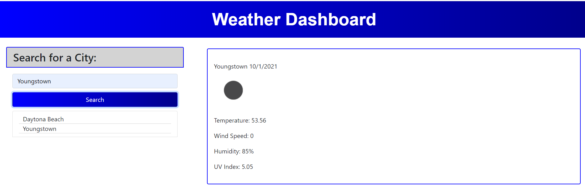
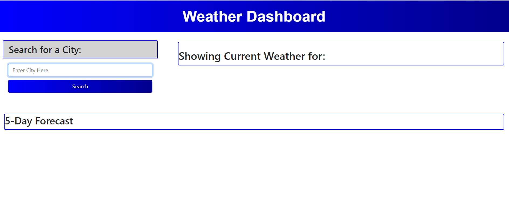
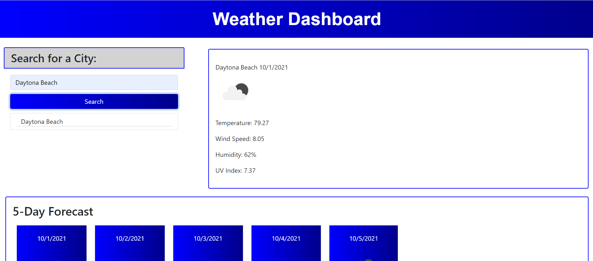
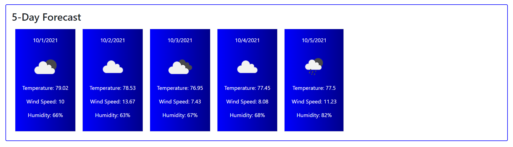
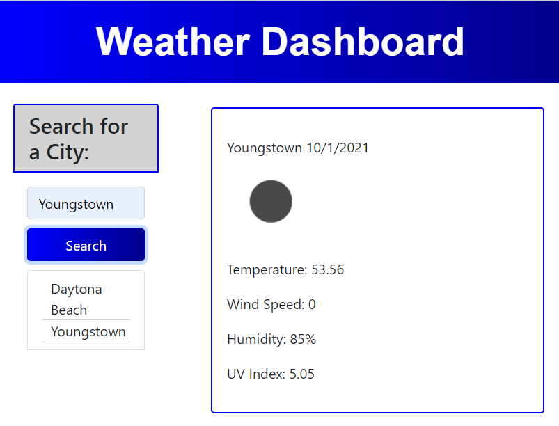
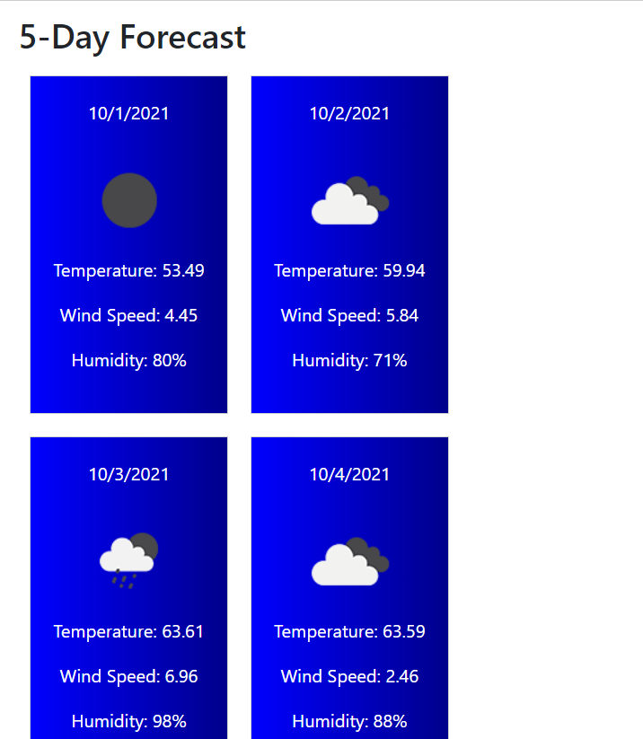

# Welcome to my WEATHER DASHBOARD for Challenge 6!

## This challenge entails creating a Weather Dashboard that utilizes HTML, CSS, and JavaScript with some help from JQuery, Bootstrap, and Moment!

 ### Once the Weather Dashboard opens, you will be greeted with an input box with a prompt to search for a City. 
 

 ### Once you enter the City that you would like the weather displayed for, you will receive the current weather for that City as well as the 5-Day Forecast. For the current weather, you will receive verification of the city name, the current date, an icon of the weather, the temperature, wind speed, humidity, and UV index. 
 

### For the 5-Day Forecast, you will receive the date, icon of the weather, the temperate, wind speed, and humidity.
 

 ### This site is fully responsive for all screen sizes.
 
 

### Click here to view my Weather Dashboard now: https://jamwil1226.github.io/weather-dashboard/

### I hope you enjoy using this Weather Dashboard! I welcome all contributions and feedback!

### I look forward to hearing from you!

### _Jamie Williams_ 

